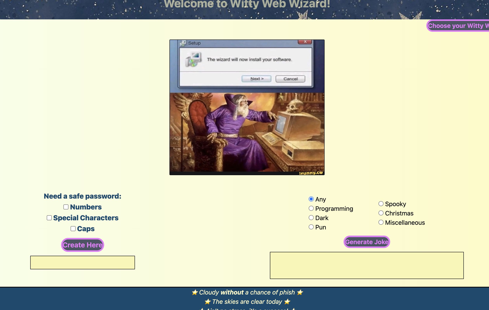

# 🧙🏿‍♂️ Witty Web Wizard

## Table of Contents

1. [Description of Witty Web Wizard](#description)

2. [Installation](#installation)

3. [Usage](#usage)

4. [Credits](#credits)

5. [License](#license)

6. [Features](#features)

## Description
Witty Web Wizard is a website that allows you to perform multitple tasks. Inlcuding generating a safe unique password for your protection. In regards to the password users have the option to save the password along with their website and/or user name it belongs to. This site also allows you to view jokes about programming.

* HTML was formatted and created for website basics.
* Tailwind was utilized and created in the HTML doc for styling purposes.
* CSS was also utlized for the styling aspects.
* Javascript was utilized for two API's, event listeners, for loops etc. to make the website interactable. 
* API passwordgenerator was called via fetch command in order to create passwords.
* Joke API was called via fetch  command in order to log jokes.

## Installation
No installation for this website is required

## Usage
[Live Site](https://briellebroadt.github.io/Witty-Web-Wizard) 
User vists the webpage, once on the page user can click buttons to view programming jokes and/or create a unique password. Users have the option to select the save icon and store information to the webpage.

## Screenshot

## Credits
Ben Birdsall, Anthony Littlejohn, Brielle Broadt

## License 
N/A
## Features
N/A